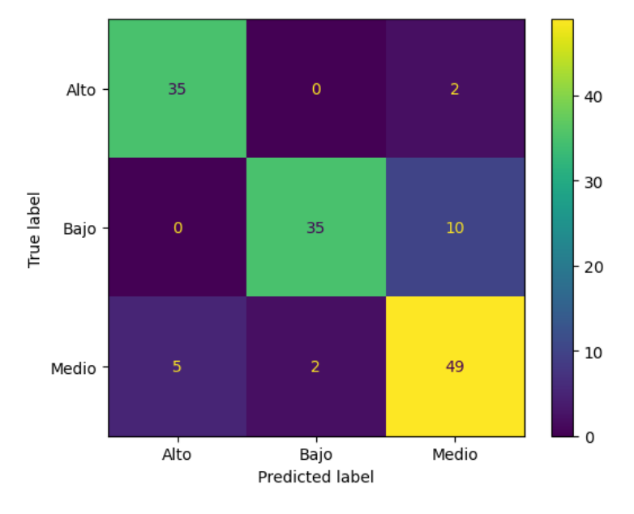

# Predicting Autism Spectrum Disorder (ASD) with Machine Learning

## 📄 Project Goal

This project aims to develop a robust machine learning framework for predicting the risk of Autism Spectrum Disorder (ASD) in adults based on demographic and screening questionnaire data. The "Autism Screening Adult" dataset from the UCI Machine Learning Repository serves as the foundation for this comprehensive study.

The project follows a multi-stage approach, tackling the problem from multiple angles:
1.  An **unsupervised learning** phase to discover natural groupings and patterns within the data.
2.  A **binary classification** task to predict a simple "ASD" vs. "No ASD" diagnosis.
3.  A **multiclass classification** task to predict nuanced risk levels (Low, Medium, High) based on the AQ-10 screening test score.

## ✨ A Multi-Staged Methodological Approach

This project is a showcase of the end-to-end data science lifecycle, from raw data ingestion to a final, validated predictive model.

### 1. Intensive ETL and Data Preparation

The initial phase involved a rigorous ETL process to transform the raw data into a clean, model-ready format. This was the most critical part of the project.
*   **Data Cleaning:** Handled raw `.arff` file format, corrected data types, cleaned column names, and methodically addressed inconsistencies (e.g., grouping "?" and "others" in categorical features).
*   **Intelligent Encoding:** Applied `LabelEncoder` and custom mappings to convert all categorical features (`gender`, `ethnicity`, `jundice`, `relation`) into a numerical format suitable for ML models.
*   **Feature Engineering:** Created a binary target variable (`aq_binary`) from the total AQ-10 test score (`result`) to simplify the initial classification problem.
*   **Data Pruning:** Logically removed features with low variance or potential to introduce bias (e.g., `used_app_before`, `age_desc`, `class_asd`) after careful consideration.

### 2. Unsupervised Learning for Feature Exploration

Before building predictive models, a comparative analysis of clustering algorithms was performed to understand the data's underlying structure.
*   **Models Tested:** K-Means, DBSCAN, and OPTICS.
*   **Evaluation:** Using metrics like Silhouette Score and Davies-Bouldin Index, it was determined that K-Means provided the most reasonable and interpretable clusters for this dataset.
*   **Key Insight:** This phase revealed which features (like `age`, `ethnicity`, and `relation`) were most influential in forming natural groups, guiding the feature selection for supervised models.

### 3. Supervised Modeling - Binary & Multiclass Classification

A comprehensive "bake-off" of multiple supervised algorithms was conducted for both binary and multiclass prediction tasks.
*   **Algorithms Evaluated:** Logistic Regression, Dense Neural Networks (with Keras Tuner for hyperparameter optimization), XGBoost, and LightGBM.
*   **Handling Class Imbalance:** Employed advanced resampling techniques like **SMOTE** and **SMOTE-Tomek** to create balanced training sets, which is crucial for a dataset where the minority class (ASD positive) is small.
*   **Final Model Selection:** A multiclass `OneVsRestClassifier` using an `SVC` estimator was selected as the final, best-performing model. This model was trained within a `scikit-learn` pipeline that automated preprocessing (scaling, One-Hot Encoding) and was fine-tuned using `GridSearchCV`.

## 🏆 Final Model & Performance

The selected model is a **Multiclass SVC** designed to predict a subject's risk level ("Bajo", "Medio", "Alto") based on their AQ-10 test score. It demonstrated excellent and well-balanced performance on the test set.

| Metric | Precision | Recall | F1-Score |
| :--- | :---: | :---: | :---: |
| **Alto Riesgo** | 0.88 | 0.95 | 0.91 |
| **Bajo Riesgo** | 0.95 | 0.78 | 0.85 |
| **Medio Riesgo**| 0.80 | 0.88 | 0.84 |
| **Accuracy (Overall)** | | | **0.86** |
| **Macro Avg F1-Score**| | | **0.87** |

*(Te recomiendo añadir aquí la imagen de tu matriz de confusión del modelo multiclase. Es un visual muy potente).*

## 💻 Technologies Used

*   **Data Processing:** Python, Pandas, NumPy, Scikit-learn (`Pipeline`, `ColumnTransformer`, encoders, scalers)
*   **Machine Learning:**
    *   **Unsupervised:** `Scikit-learn` (KMeans, DBSCAN, OPTICS)
    *   **Supervised:** `Scikit-learn` (LogisticRegression, SVC, GridSearchCV), `Keras/TensorFlow` (for DNN), `XGBoost`, `LightGBM`
*   **Resampling:** `Imbalanced-learn` (SMOTE, SMOTETomek)
*   **Environment:** Jupyter Notebook

## 🚀 Getting Started

To reproduce the analysis:
1.  Clone the repository.
2.  Install the necessary libraries from `requirements.txt` (si creas uno) o la lista de imports.
3.  Open the Jupyter Notebook (`.ipynb`) and execute the cells to follow the complete analysis from ETL to final model evaluation.

## 👤 Author

**Antonio Barrera Mora**

*   **LinkedIn:** https://www.linkedin.com/in/anbamo/
*   **GitHub:** @Kamaranis